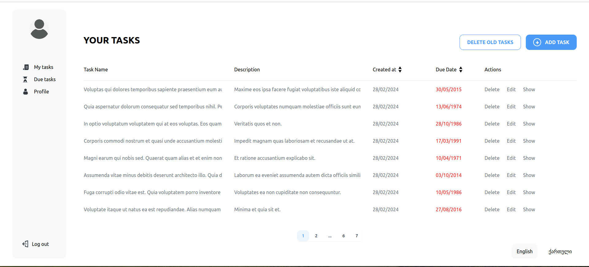
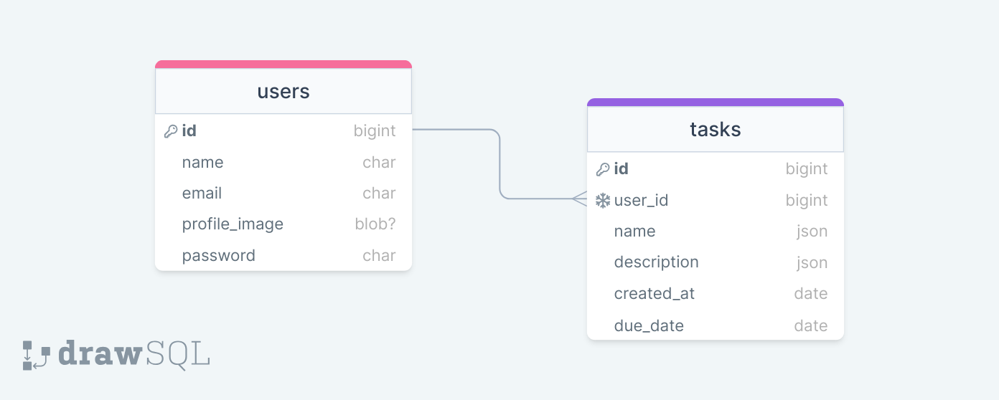

<div style="display:flex; align-items: center">
  
  <h1 style="position:relative; top: -6px" >Task Manager Application</h1>
</div>

---

Welcome to the Task Manager Application! This application is designed to help users manage tasks efficiently. Users can log in, view, add, edit, and delete tasks, with additional features such as sorting by creation date and due date, filtering for overdue tasks, and profile management.

### Table of Contents

-   [Prerequisites](#prerequisites)
-   [Tech Stack](#tech-stack)
-   [Getting Started](#getting-started)
-   [Database Setup](#database-setup)
-   [Development](#development)
-   [Project Structure](#project-structure)

### Prerequisites

Make sure you have the following software installed on your system:

-   PHP 8.3
-   MySQL 8
-   Node.js 10
-   Composer 2.7

### Tech Stack

The Task Manager Application is built using the following technologies:

-   Laravel 8.0 - Back-end framework
-   Laravel Nova - Admin Panel
-   Laravel Mix - Webpack wrapper for asset compilation
-   JWT Auth - Authentication system
-   Spatie Translatable - Language translation

### Getting Started

1. Clone the Task Manager repository from GitHub:

```sh
git clone https://github.com/RedberryInternship/task-manager-omar-jangavadze.git
```

1\. Next step requires you to run _composer install_ in order to install all the dependencies.

```sh
composer install
```

2\. after you have installed all the PHP dependencies, it's time to install all the JS dependencies:

```sh
npm install
```

and also:

```sh
npm run dev
```

3\. Now we need to set our env file. Go to the root of your project and execute this command.

```sh
cp .env.example .env
```

And now you should provide **.env** file all the necessary environment variables:

#

**MYSQL:**

> DB_CONNECTION=mysql

> DB_HOST=127.0.0.1

> DB_PORT=3306

> DB_DATABASE=**\***

> DB_USERNAME=**\***

> DB_PASSWORD=**\***

#

```sh
php artisan config:cache
```

in order to cache environment variables.

##### Now, you should be good to go!

#

### Migration

if you've completed getting started section, then migrating database if fairly simple process, just execute:

```sh
php artisan migrate
```

#

### Development

You can run Laravel's built-in development server by executing:

```sh
  php artisan serve
```

when working on JS you may run:

```sh
  npm run dev
```

it builds your js files into executable scripts.

#

### Project Structure

```bash
├─── app/
├── Console
├── Exceptions
├── Http
│   ├── Controllers
│   └── Middleware
├── Models
├── Providers
bootstrap/
config/
database/
lang/
node_modules/
public/
resources/
routes/
storage/
tests/
vendor/
.env
artisan
composer.json
tailwind.config.js
vite.config.js
```

### Interaction


